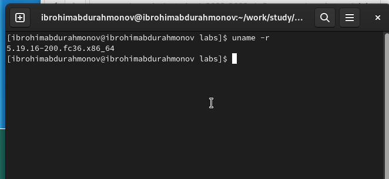
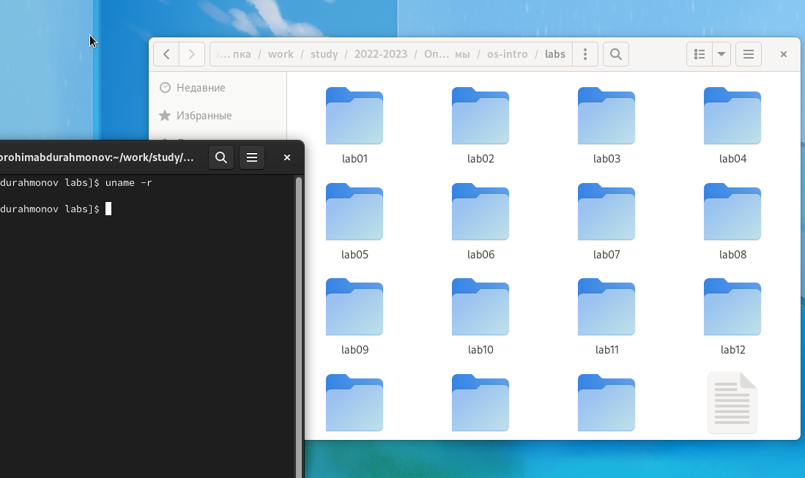
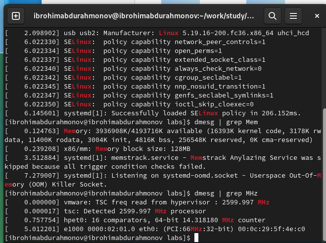

---
## Front matter
lang: ru-RU
title: Установка ОС на виртуальную машину
author: |
	  Абдурахмонов Иброхимджон\inst{1}

institute: |
	\inst{1}Российский Университет Дружбы Народов

date: 8 июня, 2023, Москва, Россия

## Formatting
mainfont: PT Serif
romanfont: PT Serif
sansfont: PT Sans
monofont: PT Mono
toc: false
slide_level: 2
theme: metropolis
header-includes: 
 - \metroset{progressbar=frametitle,sectionpage=progressbar,numbering=fraction}
 - '\makeatletter'
 - '\beamer@ignorenonframefalse'
 - '\makeatother'
aspectratio: 43
section-titles: true

---

# Цели и задачи работы

## Цель лабораторной работы

Целью данной работы является приобретение практических навыков установки операционной системы на виртуальную машину, настройки минимально необходимых для дальнейшей работы сервисов

# Процесс выполнения лабораторной работы

## Установлена система

{ #fig:001 width=70% height=70% }

## Установлена система

{ #fig:002 width=70% height=70% }

## Установлена система

{ #fig:003 width=70% height=70% }

# Выводы по проделанной работе

## Вывод

Мы приобрели практические навыки установки операционной системы на виртуальную машину, настройки минимально необходимых для дальнейшей работы сервисов.
