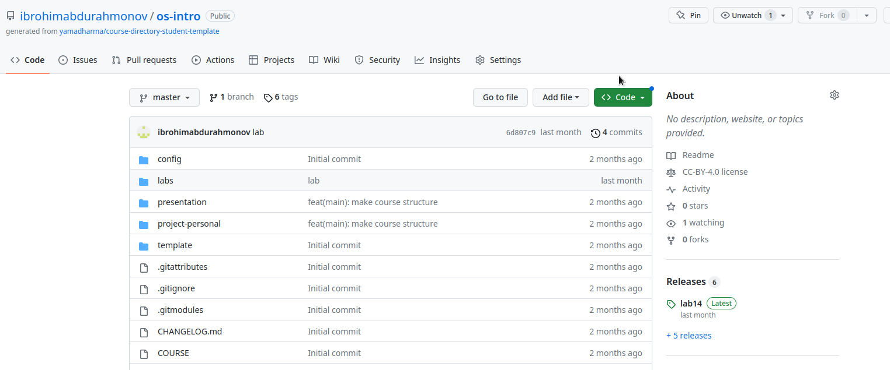
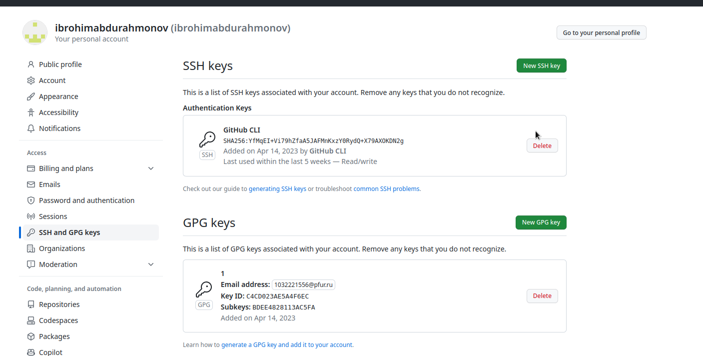
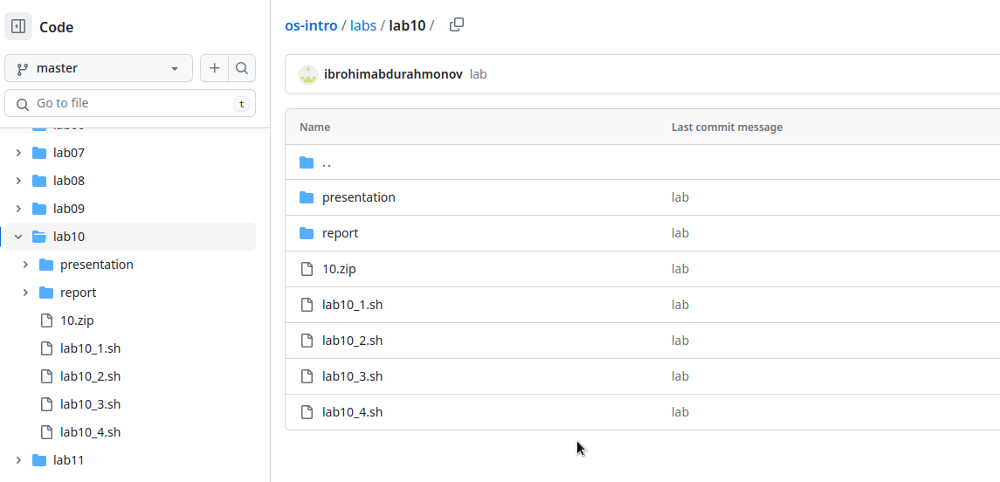
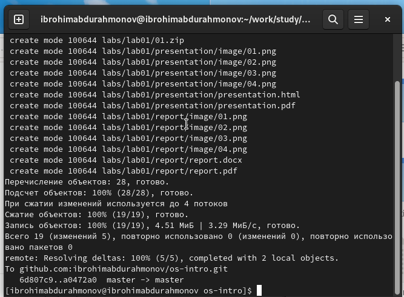

---
## Front matter
lang: ru-RU
title: Управление версиями
author: |
	  Абдурахмонов Иброхимджон\inst{1}

institute: |
	\inst{1}Российский Университет Дружбы Народов

date: 8 июня, 2023, Москва, Россия

## Formatting
mainfont: PT Serif
romanfont: PT Serif
sansfont: PT Sans
monofont: PT Mono
toc: false
slide_level: 2
theme: metropolis
header-includes: 
 - \metroset{progressbar=frametitle,sectionpage=progressbar,numbering=fraction}
 - '\makeatletter'
 - '\beamer@ignorenonframefalse'
 - '\makeatother'
aspectratio: 43
section-titles: true

---

# Цели и задачи работы

## Цель лабораторной работы

Целью данной работы является изучение идеологии и применения средств контроля версий и освоение умений работать с git.

# Процесс выполнения лабораторной работы

## Мой репозиторий

{ #fig:001 width=70% height=70% }

## Ключи шифрования

{ #fig:002 width=70% height=70% }

## Мои файлы

{ #fig:003 width=70% height=70% }

## Коммит

{ #fig:004 width=70% height=70% }

# Выводы по проделанной работе

## Вывод

Мы приобрели практические навыки работы с сервисом github.
